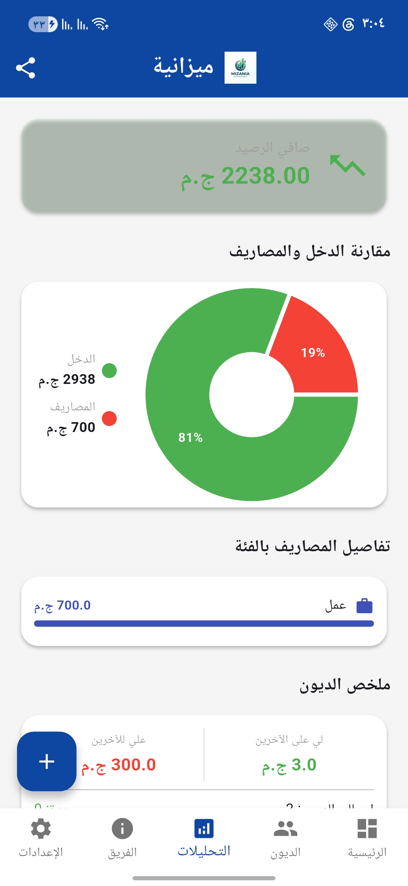
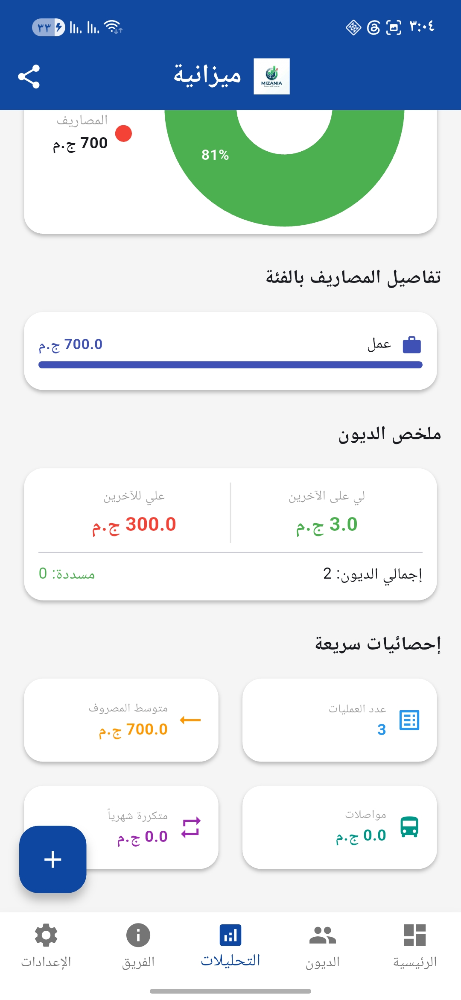
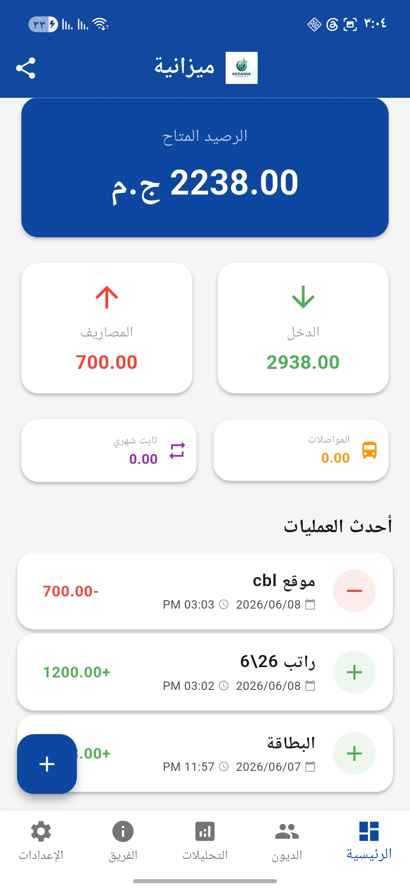
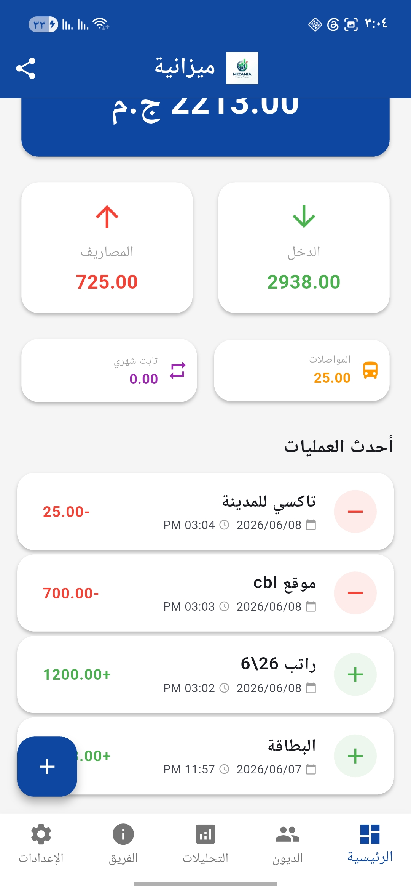
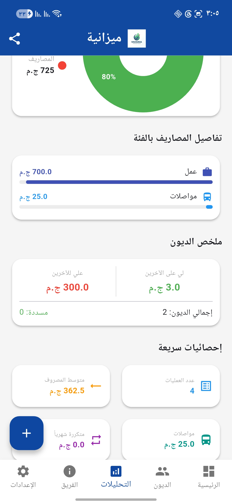
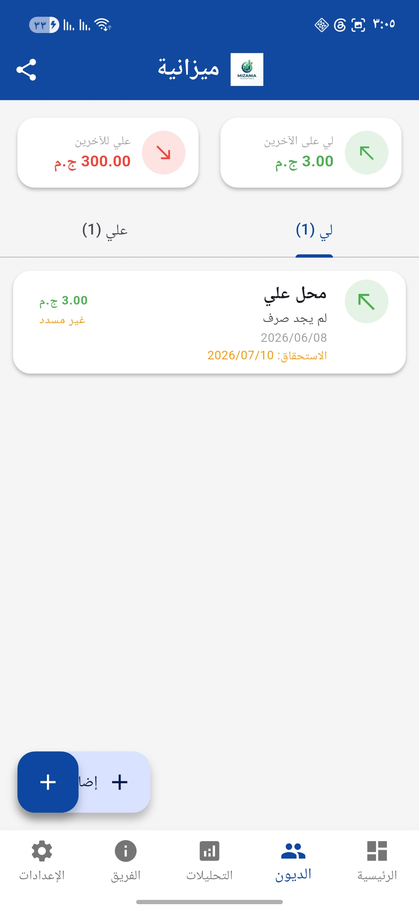
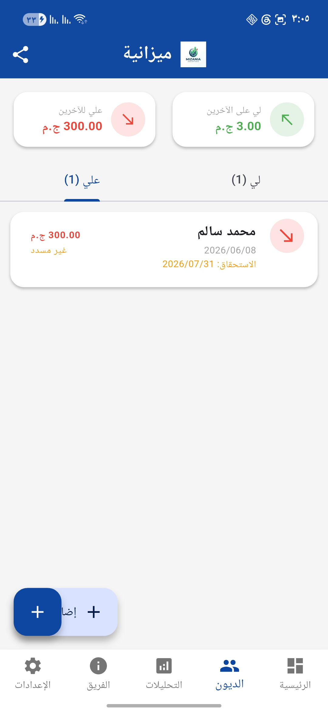
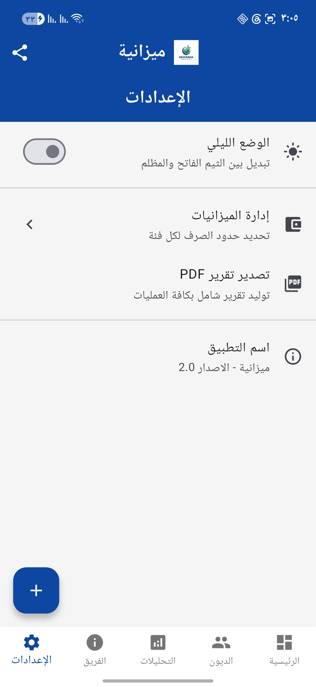

<div align="center">


# 💰 ميزانية — تطبيق إدارة المال الشخصي

**تطبيق عربي متكامل لإدارة مالية ذكية وسهلة على هاتفك**

[](https://flutter.dev)
[](https://android.com)
[](LICENSE)
[](https://ar.wikipedia.org)

[📥 تحميل التطبيق](#تحميل) • [✨ المميزات](#المميزات) • [📸 لقطات الشاشة](#لقطات-الشاشة) • [👨‍💻 الفريق](#الفريق)

</div>

---

## 📖 عن التطبيق

**ميزانية** هو تطبيق مجاني ومفتوح المصدر لإدارة الأموال الشخصية، مصمم خصيصاً للمستخدم العربي بدعم كامل للغة العربية واتجاه RTL. يمكّنك التطبيق من تتبع دخلك ومصاريفك وديونك بشكل يومي احترافي وسهل، مع تقارير بصرية شاملة تساعدك على اتخاذ قرارات مالية أفضل.

> 🎯 **الهدف:** تمكين كل شخص من السيطرة على ماله بأداة بسيطة وفعالة

---

## ✨ المميزات

### 💳 إدارة المعاملات
- ✅ تسجيل الدخل والمصاريف مع **التاريخ والوقت** بدقة
- ✅ تصنيف المعاملات: طعام، مواصلات، إيجار، فواتير، صحة، عمل وأخرى
- ✅ **إرفاق صور** للفواتير والإيصالات (كاميرا أو معرض الصور)
- ✅ مسح **رموز QR** استيراد المبالغ تلقائياً
- ✅ دعم **المصاريف المتكررة** الشهرية
- ✅ إضافة ملاحظات لكل معاملة

### 📊 لوحة التحكم
- ✅ عرض **الرصيد الكلي** فوري
- ✅ إجمالي الدخل والمصاريف دفعة واحدة
- ✅ إحصائيات المواصلات والمصاريف الثابتة
- ✅ قائمة أحدث العمليات مع التاريخ والوقت والصورة

### 🤝 إدارة الديون
- ✅ تسجيل **الديون لي** (أموال أقرضتها للآخرين)
- ✅ تسجيل **الديون علي** (أموال اقترضتها من الآخرين)
- ✅ متابعة تواريخ الاستحقاق مع **تنبيه للمتأخرة**
- ✅ تغيير حالة الدين (مسدد/غير مسدد) بضغطة واحدة
- ✅ ملخص مالي للديون الإجمالية

### 📈 التحليلات والتقارير
- ✅ **رسم دائري** Pie Chart لمقارنة الدخل والمصاريف
- ✅ تفاصيل المصاريف مصنّفة بأشرطة تقدم بصرية
- ✅ ملخص الديون المسددة وغير المسددة
- ✅ شبكة إحصائيات سريعة: العمليات، المتوسط، المواصلات
- ✅ **تصدير تقارير PDF** احترافية

### 🎨 تجربة المستخدم
- ✅ دعم **الوضع الليلي Dark Mode** الكامل
- ✅ واجهة مصممة خصيصاً للغة العربية RTL
- ✅ **حفظ البيانات محلياً** (خصوصية كاملة، بلا سحابة)
- ✅ صفحة تعريف بالفريق مع روابط التواصل

---

## 📸 لقطات الشاشة

<div align="center">

| لوحة التحكم | التحليلات |
|:-----------:|:---------:|
|  |  |

| الديون | إضافة عملية | الميزانية |
|:------:|:-----------:|:---------:|
|  |  |  |

| تفاصيل العملية | الإعدادات | الفريق |
|:--------------:|:---------:|:------:|
|  |  |  |

</div>

---

## 🚀 تحميل

<div align="center">

### ⬇️ [تحميل أحدث إصدار APK](https://github.com/KhledAboaesh/mizania/releases/latest)

أو قم ببناء التطبيق بنفسك من المصدر ↓

</div>

---

## 🛠️ البناء من المصدر

### المتطلبات
- Flutter SDK >= 3.0.0
- Dart >= 3.0.0
- Android SDK 36+
- Android Studio / VS Code

### خطوات التثبيت

```bash
# استنسخ المستودع
git clone https://github.com/KhledAboaesh/mizania.git
cd mizania

# تثبيت الاعتمادات
flutter pub get

# تشغيل في وضع التطوير
flutter run

# بناء APK للإصدار
flutter build apk --release
```

---

## 🏗️ البنية التقنية

| المكون | التقنية |
|--------|---------|
| **إطار العمل** | Flutter 3.x + Dart |
| **إدارة الحالة** | Provider |
| **التخزين** | JSON محلي (path_provider) |
| **الرسوم البيانية** | fl_chart |
| **الوسائط** | image_picker |
| **QR Scanner** | mobile_scanner |
| **تقارير PDF** | pdf + printing |
| **الـ UUID** | uuid |

---

## 📁 هيكل المشروع

```
mizania/
├── lib/
│   ├── models/           # نماذج البيانات (معاملة، دين، ميزانية)
│   ├── screens/          # شاشات التطبيق
│   ├── services/         # خدمات البيانات والحالة
│   ├── theme/            # تصميم الألوان والخطوط
│   ├── widgets/          # مكونات واجهة مشتركة
│   └── main.dart
├── assets/               # الأصول (شعار، صور)
├── android/              # إعدادات أندرويد
└── im/                   # لقطات الشاشة
```

---

## 👨‍💻 الفريق

<div align="center">

**فريق سراج للتطوير**

[](https://www.facebook.com/profile.php?id=100078414146652)

</div>

---

## 📄 الرخصة

هذا المشروع مرخص تحت رخصة **MIT** — انظر ملف [LICENSE](LICENSE) للتفاصيل.

---

<div align="center">

صُنع بـ ❤️ في **فريق سراج**

⭐ أعطنا نجمة إذا أعجبك المشروع!

</div>
